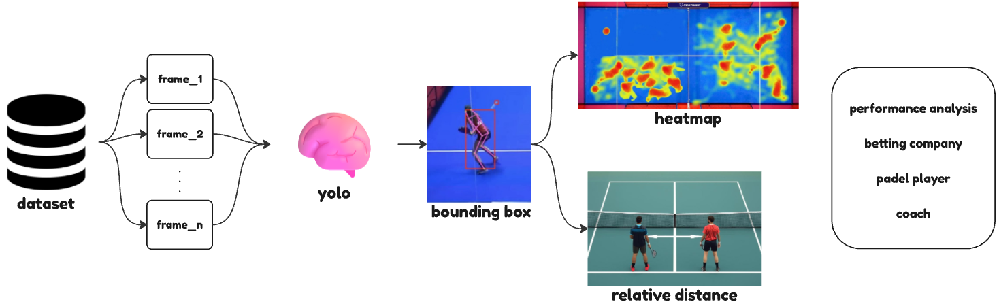
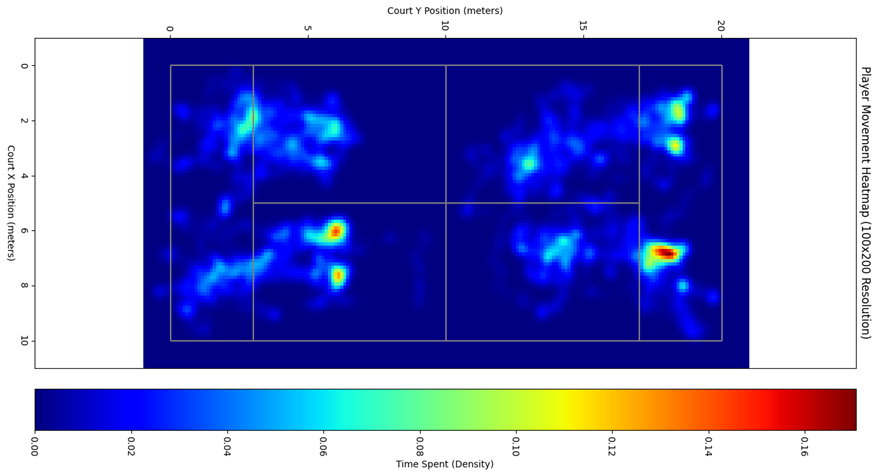

# 2025-P10-Ball-Player-Tracking-Padel

## Abstract
Padel is one of the fastest-growing racket sports worldwide, characterized by high-speed rallies, complex player interactions, and constrained playing spaces. Despite this complexity, performance analysis in padel still largely relies on manual video review, which is time-consuming, subjective, and difficult to scale.

In this work, we propose an automated, data-driven framework for player and ball tracking in padel match videos using deep learning-based object detection. Leveraging a large-scale, frame-annotated dataset captured from a single fixed camera, we evaluate multiple YOLO-based architectures and analyze the impact of input resolution on detection accuracy and inference efficiency.

Beyond detection, we introduce a pipeline for extracting actionable performance statistics, including player heatmaps and average inter-player distance, enabling objective tactical insights. Experimental results show strong performance in player detection and highlight current limitations in ball recall, motivating future fine-tuning and tracking-based refinements. This work establishes a reproducible baseline for automated padel analytics and demonstrates the potential of computer vision to support coaches, players, and performance analysts.

## How it works
The pipeline:
- from the input video, we extract individual frames
- processes each frame with YOLO to obtain player and ball bounding boxes
- aggregates detections to compute positional heatmaps and relative inter-player distances for downstream performance analysis.

<p align="center">
  
</p>

_Figure: Overview of the proposed pipeline_

## Dataset
For this project we use [PadelTracker100: A Dataset for Intelligent Player and Ball Tracking in Padel Sports](https://zenodo.org/records/14653706)
The dataset contains approximately *100,000 frames* extracted from two matches of the 2022 World Padel Tour (WPT) Finals, captured from a *single fixed camera* with resolution 30FPS.

We focus on two full-match videos:
- 2022_BCN_FinalF_1.mp4 (women’s final): 45,934 frames at 30 FPS, 1080p resolution
- 2022_BCN_FinalM_1.mp4 (men’s final): 53,953 frames at 30 FPS, 1080p resolution


Each frame is annotated with *players*, *ball* and *shot-type* labels.

## Main Results
**Fine-tuned vs pretrained (YOLO11n, imgsz=1280)**
| Metric     | Class       | Δ (fine-tuned vs pretrained)
|-----------|-------------|------------------------------:
| Precision | person      | +13.2%                       
| Precision | sport ball  | +0.7%                        
| Recall    | person      | +6.6%                        
| Recall    | sport ball  | +54.7%                       

These results show that fine-tuning YOLO11n on the PadelTracker100 dataset substantially improves detection quality, especially for the **sport ball** class. In particular, we observe a large recall gain on the ball, while maintaining a consistent precision improvement on both players and ball, confirming the benefit of domain-specific adaptation over the pretrained model.

**Inter-player distance**\
Using the predicted player positions, we compute the average distance between teammates over the full match:

| Team | Avg total distance (m) | Avg horizontal distance (m) |
|------|------------------------:|----------------------------:|
| A    | 4.85                   | 4.19                        |
| B    | 5.04                   | 4.58                        |

**Heatmap**\
This provides an intuitive view of where each team spends most of the time and how they distribute themselves in attack and defense.

<p align="center">
  
</p>

_Figure: Heatmap_


## Repo structure
The repository is organized as:
```
2025-P10-Ball-Player-Tracking-Padel
    ├── Checkpoints/                                 # Project checkpoint pdf
        └── Checkpoint1.pdf
        └── Checkpoint2.pdf
        └── Checkpoint3.pdf
    ├── predictions/                                # Model prediction outputs (JSON)
        └── predictionsF.json                       # prediction of the female match
        └── predictionsM.json                       # prediction of the male match
    ├── script/                                     # Scripts
        └── CodeStatisticsDeliverable.ipynb         # 
        └── extraction.py                           # extracts frames from raw videos
        └── inference.py                            # use the pretrained model to generate the baseline predictions
        └── predictions.py                          # use the best fine-tuned model to produce final predictions
        └── prova.py                                # scratch script for quick tests
        └── ready.py                                # prepare YOLO dataset
        └── train.py                                # train YOLO models across different configurations
    ├── LINKS-Padel_Object_Tracking.pdf        
    ├── .gitignore                    
    └── README.md                                              
```

## Get started
**Prerequisites**
- python 3.11+
- *gpu* to run YOLO models
- *enought space*: The original dataset archive is about 8 GB. When you run the `extraction.py` script, frames are extracted at 30 FPS, which results in roughly 200 GB of images. Make sure you have sufficient free storage (≈250 GB recommended) before starting the pipeline.

**Setup libraries**
```
!pip install opencv-python ultralytics pyyaml pandas numpy
```

**Option 1 – Full pipeline (inference + training + statistics)**:
1. Download the PadelTracker100 dataset .zip file from Zenodo\
[PadelTraker100](https://zenodo.org/records/14653706)\
and extract it locally before running the scripts
2. Run the `extraction.py` script to extract frames from raw videos and aggregate the labels
3. Use the `ready.py` script to generate the data.yaml file, which defines the train/test/validation image paths, the number of classes, and their names for YOLO training and inference
4. Run the `inference.py` script to evaluate the pretrained model on the test frames
- Run the `train.py` script to fine-tune the model on the padel dataset
5. Run the `predictions.py` script to obtain bounding-box predictions for the women’s and men’s matches
6. Run the `CodeStatistics.ipynb` script to compute player heatmaps and inter-player distance statistics from the predictions

**Option 2 – Only reproduce statistics (using existing predictions)**:
- Use the provided prediction files in `predictions/`, which were generated with our best YOLO configuration (`yolo10n`, `imgsz=1280`)
- Run `CodeStatistics.ipynb` to produce heatmap and inter-player distance

This second option avoids downloading the full dataset and running heavy GPU computations, and is recommended if you are mainly interested in the analysis part of the project.

## Team
- Andrea Cauda s343386 - s343386@studenti.polito.it
- Davide Tonetti s334297 - s334297@studenti.polito.it
- Antonio Visciglia s346837 - s346837@studenti.polito.it

in collaboration with LINKS Foundation.

<hr style="height: 3px; border: 0; background-color: #808080; margin-top: 40px;">

**Research Paper:** This implementation is described in detail in:\
_"Ball and Players Tracking in Padel Matches Videos"_\
Cauda A., Tonetti D., Visciglia A. (2025)